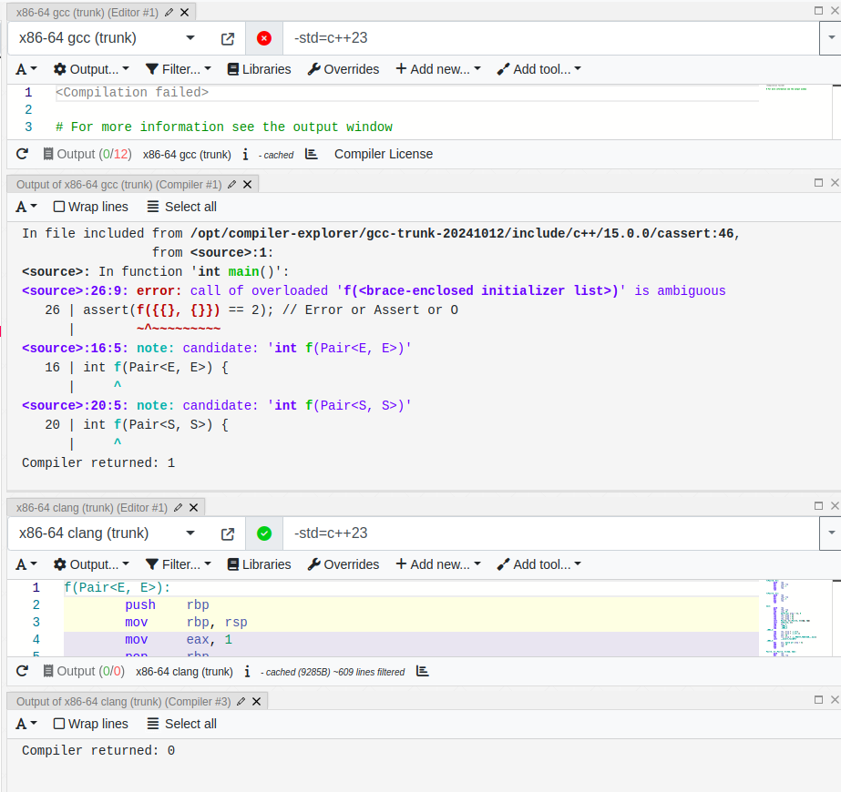
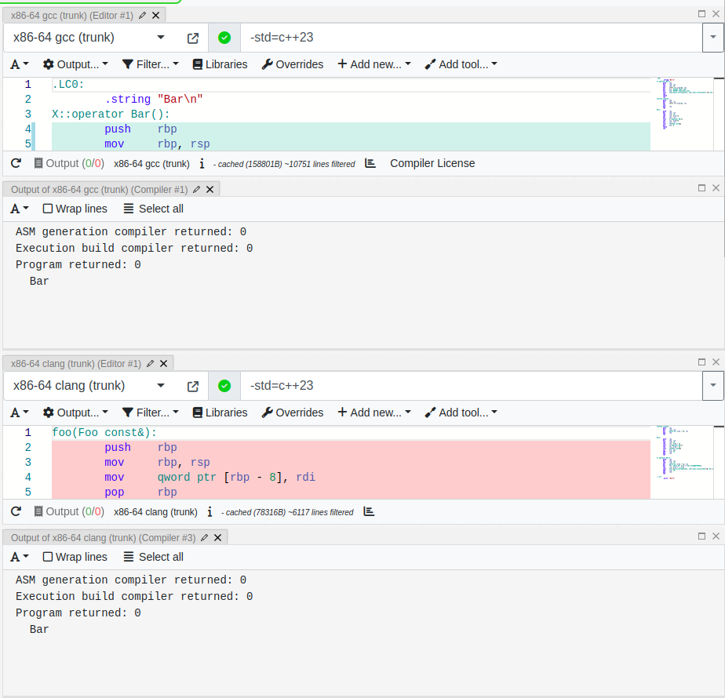

## [RAM build 
```
cmake -S . -B  build -DCMAKE_BUILD_TYPE=Release
cmake --build build
```
## [RAM run
```
./build/cram < tests/test.cram
```
# Standard tasks: what is going on?
## task 1:  https://godbolt.org/z/5ajM9W8bK
```
#include <cassert>
template <class T1, class T2>
struct Pair {
    template<class U1 = T1, class U2 = T2>
    Pair(U1&&, U2&&) {}
};

struct S {
    S() = default;
};

struct E { 
    explicit E() = default;
};

int f(Pair<E, E>) {
    return 1; 
}

int f(Pair<S, S>) {
    return 2;
}

int main() {
    assert(f({{}, {}}) == 2); // Error or Assert or O
}
```
 

Based on Proposed resolution (approved by CWG 2024-02-16): Change in 12.2.2.4 [over.match.ctor] paragraph (https://www.open-std.org/jtc1/sc22/wg21/docs/cwg_defects.html 2856. Copy-list-initialization with explicit default constructors)

When objects of class type are direct-initialized, copy-initialized from an expression of the same or a derived class type (our case), or default-initialized, overload resolution selects the constructor.

For direct-initialization or default-initialization (including default-initialization in the context of copy-list-initialization (***OUR CASE***)), the candidate functions are all the constructors of the class of the object being initialized. Otherwise, the candidate functions are all the converting constructors (11.4.8.2 [class.conv.ctor]) of that class. The argument list is the expression-list or assignment-expression of the initializer. For default-initialization in the context of copy-list-initialization, if an explicit constructor is chosen, the initialization is ill-formed (***OUR CASE***).

So, clang is right here. Explicit constructor can't be chosen. The result is OK.

## task 2: https://godbolt.org/z/W5vfr7o8G

Based on 9.4.4

A variable whose declared type is “reference to T” (9.3.4.3) shall be initialized.

There are some rules why `const Foo &` can be initialized via `struct X` prvalue:

*A reference to type “cv1 T1” is initialized by an expression of type “cv2 T2” as follows:*
* *(5.1) If the reference is an lvalue reference and the initializer expression*
* *(5.1.1) is an lvalue (but is not a bit-field), and “cv1 T1” is reference-compatible with “cv2 T2”, or*
* *(5.1.2) (***OUR CASE : see godbolt***) has a class type (i.e., T2 is a class type), where T1 is not reference-related to T2, and can be
converted to an lvalue of type “cv3 T3”, where “cv1 T1” is reference-compatible with “cv3 T3”86
(this conversion is selected by enumerating the applicable conversion functions (12.2.2.7) and
choosing the best one through overload resolution (12.2)),*

*then the reference binds to the initializer expression lvalue in the first case and to the lvalue result
of the conversion in the second case (or, in either case, to the appropriate base class subobject of the
object).*

`X{}` passed as an argument is not reference related to `const Foo &` according to 9.4.4.4, we only can consider the case (5.1.2)

The rules of choosing applicable conversion functions described in paragraph (12.2.2.7):

*The permissible types for non-explicit conversion functions are the members of R where “cv1 T” is reference-compatible ([dcl.init.ref]) with “cv2 T2”.
For direct-initialization, the permissible types for explicit conversion functions are the members of R where T2 can be converted to type T with a (possibly trivial) qualification conversion ([conv.qual]); otherwise there are none.*

Both of operators are candidates. But they have different rank (12.2.4.3) because (12.2.4.3.3.2.6) there are less conversions for `X` object (it is needed to convert to const while calling `operator Baz()`) to call non-const method.

So, this example doesn't have any ambiguity. Both of the compilers (clang and gcc) are right.
 