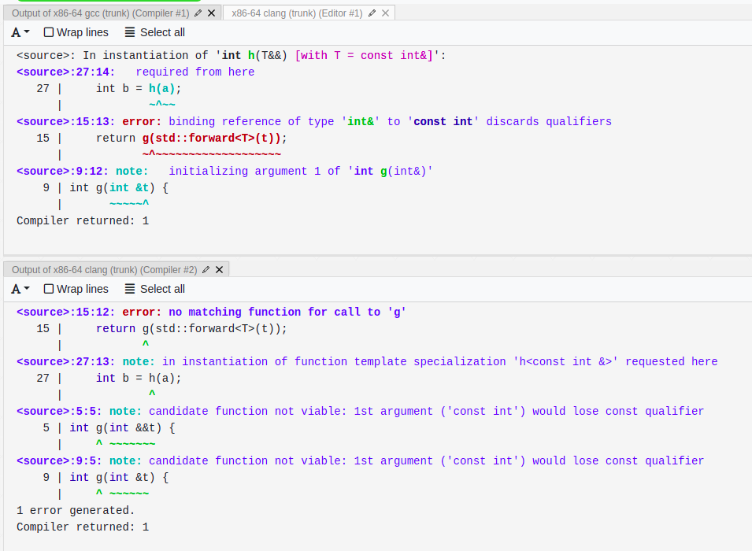

# Standard tasks: what is going on?

## task 1:
The given example is:
```
template <typename T>
int foo(T x) {
    return 42;
}

int main() {
    int x = foo(); // → int foo<void>()
}
```
In my opinion, we should not accept such behaviour. There are some reasons:
1. There is no type deduction context in the form in which it is now (template argument should be passed as a parameter of the function). Ok, let's change rules of type deduction context (already not a good idea). Somehow we know that we can ignore parameter and be sure that `int foo(T x) -> int foo(void x) -> int foo()`
2. We will break default parameters
```
template <typename T = int>
int foo(T x = 1) {
    return 1;
}

template <typename T>
int foo(T x) {
    return 2;
}

int main() {
    int x = foo(); // foo<void>()? or foo<int>(1)?
}
```
The function call looks the same, but how should we guess in such case?

3. There is an ODR violation: foo() are the same
```
template <typename T = void>
int foo() {
    return 1;
} // → int foo<void>()

template <typename T>
int foo(T x) {
    return 2;
} // → int foo<void>()

int main() {
    int x = foo();
}
```

Also, had some thoughts about some cases in overload resolution, but not enough sure to describe. Anyway, there is no reason to break all working code that is based on the behaviour of the examples above.

## task 2: https://godbolt.org/z/d5oj1fnfs
```
#include <utility>
#include <iostream>

int g(int &&t) {
    return 1;
}

int g(int &t) { 
    return 2;
}

template <typename T>
int h(T &&t) {
    return g(std::forward<T>(t));
}


int main() {
    const int a = 3;
    int b = h(a);
}
```
There is a compilation error like this:


Both gcc and clang are right. Let's have a look what is passing to g function:

1. h(a); a is `const int` and lvalue
2. `const int` is passed to `int h(T &&t)`. The forwarding reference does not discard cv-qualifiers. Lref (&) will be added to an lvalue. So, the type coming to `g` inside `h` function is `const int &`
3. `std::forward` does not do anything with lref. Thus, `std::forward` returns `const int &` too.
4. `const int &` cannot be passed into the `g(int &t)` due to [conv.qual]
