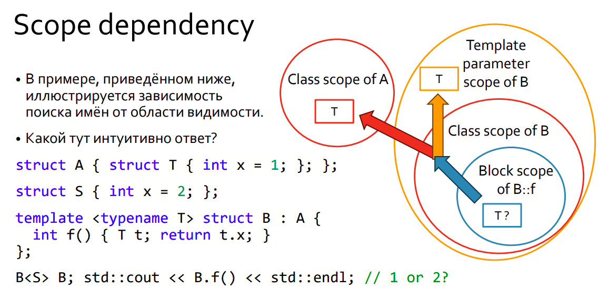

# Standard tasks: what is going on?

## task 1:
The given example is:
```
template <typename T> struct A {
  using M = T;
  struct B {
    using M = void;
    struct C;
  };
};

template <typename T> struct A<T>::B::C : A<T> {
  M m; // void or int?
};

int main() {
  A<int>::B::C x;
}
```
This example is from 13.8.3.2 [temp.dep.type]. *A base class can be the current instantiation in the case of a nested class naming an enclosing class as a base.*

In this case A<T> is the current instantiation. Then we choose A<T>::M due to these rules:



Or, following the standard, we can say that unqualified lookup is performed for M ([basic.lookup.unqual] *Note 1: When a class scope is searched, the scopes of its base classes are also searched (6.5.2). If it inherits from a
single base, it is as if the scope of the base immediately contains the scope of the derived class. Template parameter
scopes that are associated with one scope in the chain of parents are also considered (13.8.2).*)

**so, gcc is right here and M is int.**

## task 2: 
```
struct S; // Неполный тип
template <typename T> struct Wrapper { T val; };
void foo(const Wrapper<S>&) {}
Wrapper<S>& get();
int main() {
    (foo)(get()); // OK?
}
```
All is ok here. 
1. 7.5.3 [expr.prim.paren] Now (foo) is an expression. It has the same sense as foo, but other rules for name lookup.
2. 6.5.4 [basic.lookup.argdep] Parentheses prevent argument-dependent lookup. (foo) is not an unqualified-id
see Example 1:
```
namespace N {
    struct S { };
    void f(S);
}
void g() {
    N::S s;
    f(s);
    (f)(s);
}
```
3. There will be no problem with incomplete type S: ADL should instantiate if something depends on the result of instantiation. But according to the point above, ADL is not even performed here.